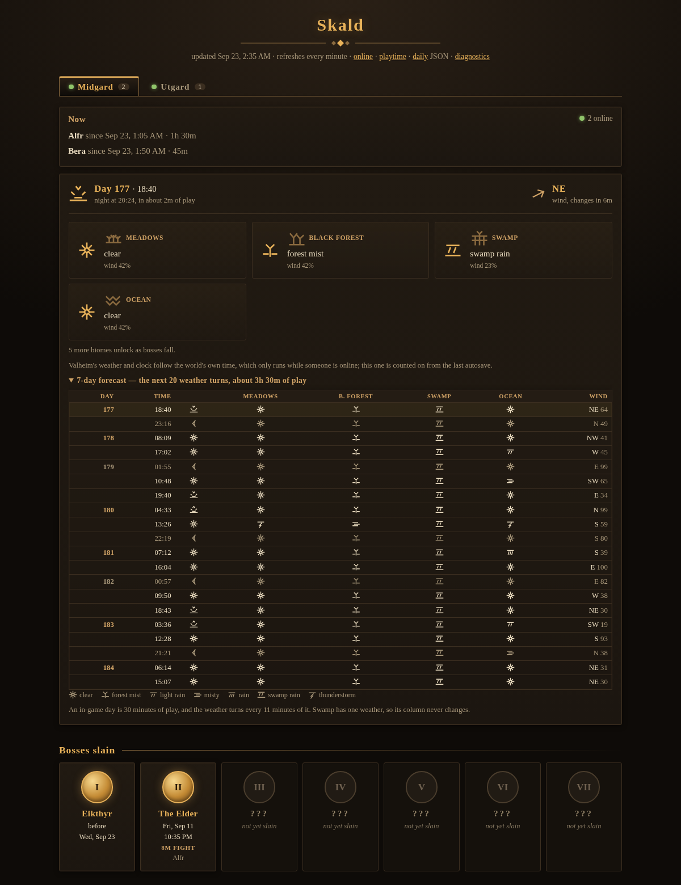
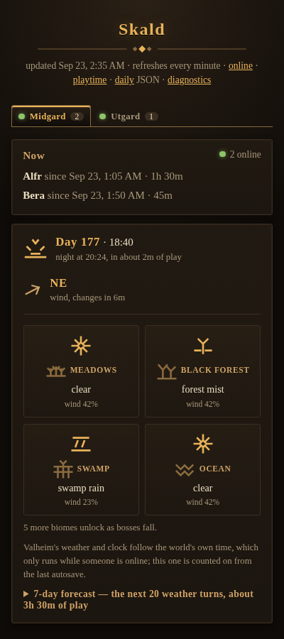

# Skald

A player and world dashboard for Valheim servers: who is online, how long
everyone has played, how often they have died, when the bosses fell, and what
the weather is doing.

It reads what the server already writes — its log and its world saves — and
serves a single page. No mods, no plugins, nothing installed in the game, and
nothing written back to your world.

> **v0.1** — the first release worth sharing. Running daily on the homelab it
> grew up in, and installed from scratch on a clean machine to make sure the
> instructions below are true. See the [roadmap](ROADMAP.md) for what is next
> and the [limitations](docs/limitations.md) for what it cannot do.


<details>
<summary><b>The 7-day forecast</b>, and what a phone sees</summary>





</details>

<details>
<summary><b>The diagnostics page</b>, for when something is missing</summary>


</details>

*(Every name in those shots is invented — see [Trying it without a
server](#trying-it-without-a-server).)*

## What it shows

- **Who is online**, per world, and for how long.
- **Playtime and deaths** per player over 24 hours, 7 days, 30 days and all
  time, with deaths per 10 hours played.
- **Boss kills as achievement badges**, dated as precisely as the evidence
  allows. Bosses you have not beaten stay nameless, so the page never spoils
  what is ahead.
- **In-game weather** for each biome you have reached, the day/night phase,
  and a 7-day forecast.
- **Charts** of player-hours, deaths and exploration per day.
- **Optional sign-in through Steam**, which adds personal features without
  changing anything for people who do not.
- JSON for all of it, if you would rather build your own view.

## How it knows

Valheim answers a Steam query with a player *count* and blank names, so the
names come from the server's own log: a hook copies the handful of lines
that matter (connections, characters, deaths, landmarks, global keys) into a
file Skald reads. Boss kills come from the world save, which is also where
the clock lives — and the weather is *computed* from that clock, because
Valheim's weather is deterministic.

[**How it works**](docs/how-it-works.md) explains all of it, including the
parts that took some finding: why a death looks like a join, why a missed
goodbye must not merge two sessions, and why the world clock only runs while
someone is online.

## Requirements

Either the [`lloesche/valheim-server`](https://github.com/lloesche/valheim-server-docker)
image, whose log hook feeds Skald directly, **or any server that writes its
log to a file** — Skald reads that instead, skipping the noise. It also
reads each world's save directory, and your backups if you have them.

## Quick start

From nothing to a dashboard, on a machine with Docker:

```sh
curl -fsSLO https://raw.githubusercontent.com/casmith/skald/main/compose.example.yaml
mv compose.example.yaml compose.yaml
echo 'SERVER_PASS=choose-something' > .env    # Valheim wants 5+ characters
docker compose up -d
```

Then open `http://<host>:8080`.

A brand-new world looks empty, and should: sessions and deaths appear as
people play, and the in-game clock, the weather and the forecast need the
world's first autosave, which Valheim writes every 30 minutes. `/diagnostics`
says which of those it is still waiting for.

The part that matters if you are adding Skald to servers you already run is
the log hook, which is what feeds it:

```yaml
x-skald-hook: &skald-hook
  VALHEIM_LOG_FILTER_REGEXP_Skald: "Got connection SteamID|Got character ZDOID from|Closing socket|OnApplicationQuit|Placed location |Setting global key |Spawning boss "
  ON_VALHEIM_LOG_FILTER_REGEXP_Skald: 'cat >> "/events/$${WORLD_NAME}.log"'
```

Each game server needs that in its environment, the shared `events` volume,
and `STATUS_HTTP: "true"`; Skald needs the events volume, its own `data`
volume, and each world's `config` volume mounted read-only at
`/saves/<WORLD_NAME>`. A world's name must match the game's `WORLD_NAME`.

## Trying it without a server

`tools/demo.py` builds a month of invented history — two worlds, four
players, sessions, deaths, exploration, a boss falling mid-fight — so you can
see the thing working before wiring it to a game server:

```sh
python3 tools/demo.py --out /tmp/skald-demo
SKALD_EVENTS_DIR=/tmp/skald-demo/events SKALD_DATA_DIR=/tmp/skald-demo/data \
SKALD_SAVES_ROOT=/tmp/skald-demo/saves \
SKALD_WORLDS="Midgard=http://none/status.json" python3 -m skald
```

It is also what the screenshots above are made from, which is deliberate:
this repository should never need a real player's name in it.

## Configuration

Settings come from a TOML file, with environment variables overriding it.
Both are optional: the defaults below apply under each. See
[`skald.example.toml`](skald.example.toml).

```toml
timezone = "America/Chicago"
default_world = "Midgard"

[[worlds]]
name = "Midgard"                 # must match the game's WORLD_NAME
status_url = "http://midgard/status.json"
```

Mount it at `/config/skald.toml`, or point `SKALD_CONFIG` elsewhere.

| Setting | Variable | Default | What |
|---|---|---|---|
| `worlds` | `SKALD_WORLDS` | — | `Name=http://host/status.json`, comma separated, when you would rather not use the file |
| `default_world` | `SKALD_DEFAULT_WORLD` | first world | Which tab opens first |
| `port` | `SKALD_PORT` | `8080` | Port to listen on |
| `timezone` | `SKALD_TZ` | `UTC` | Dates, and where a day starts for the charts |
| `events_dir` | `SKALD_EVENTS_DIR` | `/events` | Where the log hook writes |
| `data_dir` | `SKALD_DATA_DIR` | `/data` | Skald's own state |
| `saves_root` | `SKALD_SAVES_ROOT` | `/saves` | `<root>/<World>/worlds_local/<World>/` |
| `backups_root` | `SKALD_BACKUPS_ROOT` | `/nas` | `<root>/<world lowercased>/backups/worlds-*.zip`. Optional |

A world can override `saves_dir` or `backups_dir` if its files sit somewhere
unusual. The older `TRACKER_*` variable names still work.

## Where the data lives

`data_dir` holds one SQLite file, `skald.db`. The hook's event files are
where *new* lines arrive, but they are not a good long-term home — they can
be rotated, trimmed or lost — so every line is taken in once, keyed by its
own text, and everything is read from the database after that. Ingestion is
incremental: a file that has only grown is read from where it left off, and
one that shrank is read again, where the key makes the repeats free.

That also means history outlives the files. Back up `skald.db` and you have
every session, death and milestone; the event files can go.

Upgrading from a version that kept `milestones.json`? It is imported on
first run, once. Nothing is deleted.

## When something is missing

**`/diagnostics`** answers "why is X not showing?" — every path with whether
it exists and can be read, every world with whether its events, saves and
backups are arriving, and where each setting came from (file, which variable,
or the default). `/api/diagnostics` returns the same as JSON.

## Keeping up with Valheim

Skald reads files and log lines the game owns, and the game changes. Rather
than fail quietly when it does, Skald records what it met and shows it on
`/diagnostics`:

- **The game version** each server reports (free, from its status endpoint),
  marked against the versions Skald's weather tables and log patterns were
  checked with.
- **The save format's version number**, marked against the ones it knows. An
  unfamiliar one is still read — that header has not moved in years — but it
  says so rather than pretending.
- **Lines carrying the game's timestamp that matched nothing Skald knows.**
  If an update rewords a line, this number climbs, which is the difference
  between "something is missing" and "everything looks fine".

## Permissions

Skald runs as an unprivileged user (uid 10001) and writes to two places: its
own `data_dir`, and nothing in `events_dir` — that one is shared, because the
game's log hook appends to it as whichever user the game container runs as.

**Named Docker volumes need nothing**: the image creates both directories
with the right ownership, and Docker copies that onto a fresh volume.

**Bind mounts, and volumes from before 0.1.0, do need a hand** — they keep
the host's ownership, which is usually root:

```sh
chown -R 10001:10001 /path/to/data      # or: docker run --rm -v <volume>:/d alpine chown -R 10001:10001 /d
chmod 1777 /path/to/events              # shared with the game's hook
```

If Skald cannot open its database it exits saying so, rather than serving
pages that fail; `/healthz` answers only when the database is reachable, so
a "healthy" container is one that actually works.

## Privacy

Skald shows player names and who is playing right now. Think before putting
it on the public internet: it is a log of when your friends are at their
computers. It is read-only and exposes no Steam IDs, but the sensible default
is to keep it on your own network or behind an authenticating proxy.

## Documentation

- [Installing](docs/install.md) — from nothing, or alongside servers you
  already run, plus permissions and upgrades
- [Configuration](docs/configuration.md) — every setting, and the API
- [How it works](docs/how-it-works.md) — the log lines, the saves, the clock
  and the weather
- [Limitations](docs/limitations.md) — what it cannot do, and why
- [Changelog](CHANGELOG.md) · [Roadmap](ROADMAP.md)

## Attribution

The weather engine is a port of
[Jere Kuusela's valheim-weather](https://github.com/JereKuusela/valheim-weather)
(Unlicense, public domain), which is the reference for the period lengths, the
biome tables and Unity's random-number quirks. The rune-style glyphs are
original SVG.

Skald is a fan project, not affiliated with or endorsed by Iron Gate AB.
Valheim is their trademark.

MIT licensed — see [LICENSE](LICENSE).
